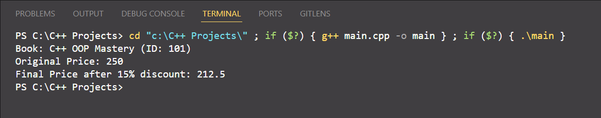

# My OOP Projects 📚

This repository contains my practice on **Object-Oriented Programming** using C++.

## 🚀 Project: Book Class
A simple program that demonstrates **Encapsulation** in C++.

### Features:
- Private data members for security.
- Constructor to initialize book details.
- Function to calculate price after discount.

### How to Run:
1. Compile the `main.cpp` file.
2. Run the generated executable.
 